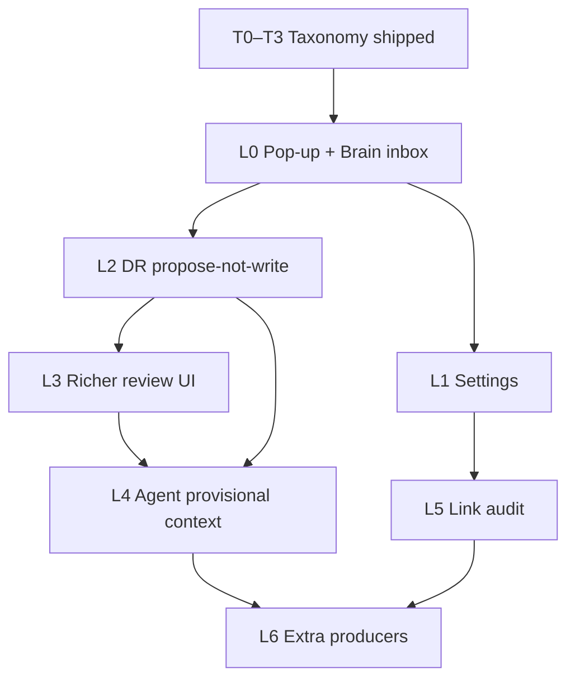

# Learned Graph Connections Roadmap

**Connections are learned from your work, approved by you — modeled on the Skills draft/publish lifecycle.**

**Status:** **L0 shipped** (partial) on `feature/projects`. **Decisions locked** (2026-06-01). **L1–L6** ready to implement.

**Last updated:** 2026-06-01 (v1.2)

**Use this doc when starting work:** *"Follow docs/learned-graph-connections-roadmap_v1.md Phase L2"*.

**Prerequisite:** [Knowledge Graph Edge Taxonomy](knowledge-graph-edge-taxonomy-roadmap_v3.md) **T0–T3** (five semantic kinds, `reason` persistence, batch merge engine, `compare_papers` / DR typed edge producers).

**Related docs:**

| Doc | Relationship |
|-----|----------------|
| [`knowledge-graph-edge-taxonomy-roadmap_v3.md`](knowledge-graph-edge-taxonomy-roadmap_v3.md) | Schema, T2 `merge_subgraph`, conflict rules, producers |
| [`paper-token-retrieval-roadmap_v1.md`](paper-token-retrieval-roadmap_v1.md) | `compare_papers` → `suggested_edges` |
| [`deep-research-roadmap.md`](deep-research-roadmap.md) | Research complete → graph; must align with propose-not-write |
| **[`deep-research-ldr-migration.md`](deep-research-ldr-migration.md)** | **Active DR backend** — LDR default; typed edges still post-run Odysseus; **L6** = selective enrich; **L7** = full-text escalation |
| [`projects-roadmap.md`](projects-roadmap.md) | Project Links rail as another surfacing point |

---

## Problem

Batch merge (T2) solved **validation and partial apply** for up to 20 edges, but the default UX still felt like a developer tool (paste JSON, open a modal). Users think in terms of **skills**: the system learns from sessions, surfaces a small approval moment, and keeps a **Brain inbox** for deferred review.

Two product stories were in conflict:

| Path | Behavior | User trust |
|------|----------|------------|
| **`suggest_link` / learned connections** | Propose → user confirms | High |
| **`sync_research_graph_links()`** (DR) | Writes semantic edges on complete | Low — graph changes silently |

This roadmap unifies **propose → accept / reject / review later** across chat, compare, research, and Brain — without replacing the T2 merge engine (it becomes the batch editor behind the inbox).

---

## Design principles (align with Skills)

| Skills pattern | Learned connections equivalent |
|----------------|--------------------------------|
| Auto-extract after meaningful work (`maybe_extract_skill`) | Producers enqueue proposals (`compare_papers`, DR, agent) |
| Default **`status: draft`** | Default **`status: pending`** in `pending_edges.jsonl` |
| **`status: published`** = vetted | Accepted row in `manual_edges.jsonl` |
| **`auto_skills`** toggle | **`auto_learn_links`** (propose at all) |
| **`auto_approve_skills`** + confidence threshold | **`auto_approve_links`** (policy auto-accept non-conflicting rows) |
| Brain → Skills library | Brain → **Connections** tab |
| Conversation is primary; library is review | Pop-up first; inbox second |
| Reject / dismiss reduces noise | `rejected_edge_keys.jsonl` — do not re-propose same `(from, to, kind)` |
| Periodic audit (`skill_added` → audit job) | **`link_proposed` → link audit** (proposed) |

**Safety difference from skills:** Wrong procedures are annoying; wrong **`refutes`** edges corrupt traversal. Locked policy: **learn on** (`auto_learn_links` default `true`), **auto-approve off** (`auto_approve_links` default `false`), **no automatic edge publication** — including no auto-approved kinds and no audit auto-accept in v1.

---

## Decisions (locked)

Product choices from review — implement against this section, not the old “proposed lean” columns.

### UX & deferral

| Decision | Locked behavior |
|----------|-----------------|
| **Review later → Brain** | **Never** auto-open Brain (single or batch). Toast only: *“Saved to Brain → Connections”*. |
| **Connections tab** | Stays in **Brain** (next to Skills), not under Links. |
| **Batch merge modal** | **Keep** for power users; hide JSON paste behind **Advanced · Import JSON** (L3). |
| **Rejected keys** | **Never expire** in v1. Reject scope: per `(from, to, kind)`. |

### Learning & approval policy

| Decision | Locked behavior |
|----------|-----------------|
| **`auto_learn_links`** | Default **`true`**. When off: no producer enqueue / batch pop-ups; explicit `suggest_link` still allowed. |
| **`auto_approve_links`** | Default **`false`**. Toggle may ship in L1 but **must not auto-publish any edge kind** until product explicitly re-enables policy (see #6). |
| **`link_min_confidence`** | Default **`0.85`** when auto-approve is ever enabled later. |
| **Auto-approved kinds** | **None** in v1 — no background or audit auto-accept of pending rows. |
| **User explicit “link these”** | Agent may call **`link`** immediately when the user explicitly asked to connect items (bypass pending). |
| **Incognito / compare mode** | No learned-link extraction or pop-ups (mirror `auto_skills` gating). |

### Deep Research & producers (decision A)

| Decision | Locked behavior |
|----------|-----------------|
| **DR graph edges on complete** | **All edge proposals** — including `summarizes`, stance edges, and compare-mode paper→paper — go through **immediate review** (pop-up and/or enqueue). **No silent writes** to `manual_edges.jsonl`. |
| **DR research node** | **`upsert_research_node` only** — the `research:{session}` node may still be created/updated without edge review. |
| **Surfacing** | On complete: same **Accept / Reject / Review later** pop-up pattern as `compare_papers`. |

### Batch accept & isolation (decision B)

| Decision | Locked behavior |
|----------|-----------------|
| **Accept all (batch)** | Always run **`preview_merge_proposals()`** server-side first; apply only **ready** rows; toast skipped conflicts/duplicates. |
| **Per-owner graphs** | Pending, merge preview, and apply are **strictly owner-scoped** (`data/knowledge/users/{owner}/`). Audit in L3 that no API path leaks cross-user rows (existing isolation + tests). |

### Project visibility (decision C)

| Decision | Locked behavior |
|----------|-----------------|
| **Project chat preamble** | Include **all pending proposals that touch the project’s linked graph** (any endpoint in the project link neighborhood), labeled **`[PROPOSED]`** — not hop traversal as confirmed edges. Apply preamble token budget with truncation + *“N more in Brain → Connections”* only if the list exceeds budget. |
| **Project workspace UI** | **Also show pending in Projects** — not preamble-only. Links rail (or adjacent panel): list project-relevant pending rows with **Accept / Reject / Review in Brain**; badge count when non-zero. Same rows as Brain inbox, filtered to project-linked endpoints. |
| **Brain inbox** | **Global** queue — all pending for the owner, unfiltered. |

### Link audit (L5)

| Decision | Locked behavior |
|----------|-----------------|
| **Audit auto policy** | **Flag only** — re-run preview, surface conflicts/stale nodes, update Brain/Projects badges. **Do not** auto-accept rows while decision “no auto-approved kinds” stands. |

### L0 cleanup (known drift)

| Item | Action |
|------|--------|
| Batch **Review later** opens Brain | **Remove** — contradicts locked decision #1. |
| Batch **Accept all** without preview | **Replace** with merge preview path per locked batch-accept decision. |
| DR **silent write** | **Remove** in L2 — contradicts locked DR decision. |

---

## Integration & anti-sprawl

This feature must **extend** existing graph, merge, and suggest-link paths — not sit beside them as a second app. Every L-phase PR should **converge** code (delete, redirect, or share helpers). Adding a new surface without reusing the pipeline below is out of scope.

### Target pipeline (one queue, one validator, one writer)

```text
Producers                    Surfaces (views only)
─────────                    ────────────────────
compare_papers ──┐           Pop-up (chat)
merge_subgraph ──┼──► enqueue_proposals() ──► pending_edges.jsonl ◄── Brain → Connections
DR complete ─────┤           Projects Links (filtered)
suggest_link ────┘           Batch merge modal (Advanced editor)
        │                              │
        └──────── immediate ─────────┘  (Accept without enqueue OK)
                     │
                     ▼
        preview_merge_proposals()   ← always for batch Accept
                     │
                     ▼
        apply_merge_proposals() / accept_pending_edge()
                     │
                     ▼
        add_graph_link() → manual_edges.jsonl → _sync_edges_from_manual()
```

**Rule:** UI surfaces **never** call `add_graph_link` except through shared accept helpers that run preview when batch size > 1 (locked batch-accept decision).

### Canonical code homes (do not duplicate)

| Concern | Single owner | Others must… |
|---------|--------------|--------------|
| **Persist confirmed edge** | `src/knowledge_graph.py` → `add_graph_link()` | Call it; never write `manual_edges.jsonl` directly |
| **Validate batch / conflicts** | `src/graph_merge.py` → `preview_merge_proposals()` | Call it; do not reimplement stance/conflict rules |
| **Apply batch after preview** | `src/graph_merge.py` → `apply_merge_proposals()` | Prefer this over ad-hoc loops |
| **Pending queue** | `src/pending_graph_edges.py` | One JSONL file per owner; no Projects-specific store |
| **Proposal shape** | Shared `_coerce_proposal()` (target: `graph_merge` or `edge_taxonomy`) | Import; do not copy field parsing |
| **Conversation pop-up** | `static/js/knowledge.js` → `kg-link-suggest-card` | Reuse for single + batch; no second toast system |
| **Inbox rendering + actions** | Target: `static/js/connection_actions.js` (L3 extract) | Brain + Projects import same module |
| **Agent / SSE dispatch** | `src/agent_loop.py` → `graph_merge_proposals` / `link_suggestion` | Producers emit proposals; loop does not write edges |
| **DR on complete** | `src/research_graph.py` | L2: enqueue + SSE only; remove silent append in `sync_research_graph_links()` |

### Already integrated (L0 — keep)

- All confirmed links still land in **`manual_edges.jsonl`** via `add_graph_link()` — no second graph.
- Producers share **`{ from, to, kind, reason }`** (T3 taxonomy + compare/DR builders).
- Batch and single review reuse **`kg-link-suggest-card`** styling and queue — not a new notification framework.
- T2 **`merge_subgraph`** tool and API remain the batch validator; pending must route through it, not replace it.

### Known sprawl (L0 — fix, do not extend)

| Duplication / drift | Where | Fix in phase |
|---------------------|-------|--------------|
| Batch **Accept all** skips merge preview | `knowledge.js` → `pending/accept-batch` | **L1/L3:** Accept all → `merge/preview` + `merge/apply` (or one backend wrapper) |
| **`_coerce_proposal` copied** | `graph_merge.py` + `pending_graph_edges.py` | **L3:** Single shared helper |
| **Accept/Reject fetch duplicated** | `knowledge.js` + `learned_connections.js` | **L3:** Extract `connection_actions.js` |
| **DR silent write** parallel to pop-up | `sync_research_graph_links()` | **L2:** Remove edge append; enqueue + SSE only |
| **Batch Review later opens Brain** | `knowledge.js` | **L1:** Remove navigation |
| **Three parallel “review apps”** | Pop-up, Brain, merge modal (+ JSON) | **L3:** Modal = “Edit in table” from inbox; JSON = Advanced only |
| **`accept-batch` vs `merge/apply`** | Two backend apply paths | **L3:** Deprecate direct `accept-batch` for UI; keep thin wrapper calling merge apply |

### Surfaces are views, not systems

| Surface | Role | Must not… |
|---------|------|-----------|
| **Pop-up** | Interrupt; immediate Accept / Reject / Review later | Own queue format or write path |
| **Brain → Connections** | Global pending inbox | Duplicate merge validation logic |
| **Projects Links rail** | `GET /pending?project_id=` filter + same row UI | Store `project_pending.jsonl` or separate accept API |
| **Project preamble** | Read-only `[PROPOSED]` rows for agent context | Call `add_graph_link` from preamble builder |
| **Batch merge modal** | Power-user table; import JSON | Be the default path for compare/DR |
| **`merge_subgraph` agent tool** | Preview/apply for agent-driven batches | Bypass user pop-up when `auto_learn_links` is on (enqueue instead) |

### Phase checklist — anti-sprawl gates

Before marking a phase done, verify:

**L1**

- [ ] No new files unless prefs wiring requires it
- [ ] Batch Review later: toast only (no `openBrainConnectionsTab()`)
- [ ] Producers respect `auto_learn_links`; no second gating layer in UI only

**L2**

- [ ] `sync_research_graph_links()` does **not** append semantic edges to `manual_edges.jsonl`
- [ ] DR complete uses same SSE + pop-up path as `compare_papers`
- [ ] `upsert_research_node` remains the only automatic graph mutation on DR complete

**L3**

- [ ] Batch Accept (pop-up, Brain bulk, Projects bulk) all call **preview then apply**
- [ ] Shared `_coerce_proposal` + `connection_actions.js`
- [ ] Projects panel: filter only — no new persistence
- [ ] Merge modal opened from inbox (“Edit in table”), not a parallel entry point
- [ ] Owner isolation test: pending/merge cannot cross `users/{owner}/`

**L4**

- [x] `project_context.py` **reads** pending via shared loader; no inline accept
- [x] Preamble `[PROPOSED]` rows match Projects filter query

**L5–L6**

- [x] Audit **flags** only; reuses `preview_merge_proposals`
- [x] New producers call `enqueue_proposals()`; no new accept implementations

### Explicit “do not add”

- Separate SQLite / second graph store for pending or published edges
- Project-specific pending JSONL files
- New agent tool that writes edges without user confirm (except locked explicit `link` on user request)
- Duplicate conflict-detection logic outside `graph_merge.py`
- Fourth review UI (e.g. dedicated modal per producer)
- Auto-accept background job in v1 (locked: no auto-approved kinds)

### PR review question

For any learned-connections change, ask: **Does this add a new write path, queue, or validator — or does it route through the pipeline above?** If the answer is “new path,” refactor before merge.

---

## Capability baseline

### Shipped (L0 — foundation)

| Item | Location | Notes |
|------|----------|-------|
| **Pending store** | `src/pending_graph_edges.py` | `pending_edges.jsonl`, `rejected_edge_keys.jsonl` per owner |
| **API** | `routes/knowledge_routes.py` | `GET /pending`, `POST /pending/enqueue`, `/reject`, `/accept-batch`, `/{id}/accept` |
| **Single-link pop-up** | `static/js/knowledge.js` | **Accept** · **Reject** · **Review later** (replaces Not now / Link them) |
| **Batch pop-up** | `handleConnectionProposals()` | After `compare_papers` / `merge_subgraph` SSE — same three actions + Accept all |
| **Brain → Connections tab** | `static/js/learned_connections.js`, `index.html` | Inbox with per-row Accept / Reject; tab badge count |
| **T2 merge engine** (unchanged) | `src/graph_merge.py`, `static/js/graph_merge.js` | Power-user batch table; JSON paste still present |
| **Tests** | `tests/test_pending_graph_edges.py`, `tests/test_graph_merge.py` | Enqueue, reject key, accept; merge conflicts |

### Not shipped yet (this roadmap)

| Item | Why it matters |
|------|----------------|
| Brain **Settings** toggles for learn / auto-approve | Parity with skills; user control |
| DR **propose-not-write** for semantic edges | Fixes silent graph mutation |
| Evidence column / session deep-links in inbox | Trust — user sees *why* |
| Agent **provisional context** block | ~~Agent aware of pending links without treating them as facts~~ **L4 shipped** |
| **Link audit** scheduled job | ~~Quality loop like `audit_skills`~~ **L5 shipped** |
| Hide JSON paste / demote Batch merge modal | Primary UX = pop-up + Brain |
| Extra producers (library multi-select, session LLM extract) | More organic entry points |
| Concept-extraction subgraph pipeline | Long-term; separate track |

---

## User journeys (target)

### Journey A — Chat, single suggestion

1. Agent calls `search_knowledge` `suggest_link` with kind + reason.
2. Pop-up: **Accept** → `POST /api/knowledge/links`.
3. **Reject** → `rejected_edge_keys.jsonl`; won't re-queue.
4. **Review later** → `pending_edges.jsonl`; toast only — **does not** open Brain.

### Journey B — Compare 2–3 papers

1. `compare_papers` returns `suggested_edges`.
2. Batch pop-up: *"N learned connections"* with preview list.
3. **Accept all** → merge **preview** then apply ready rows only; toast for skipped conflicts.
4. **Review later** → enqueue; toast only (no Brain navigation).

### Journey C — Deep Research complete (L2)

1. Research finishes; `build_research_graph_edges()` produces proposals (**all kinds**, including `summarizes`).
2. **No** writes to `manual_edges.jsonl` on complete — enqueue + pop-up immediately.
3. Research **node** upsert still runs; edges wait for user Accept.

### Journey D — Deferred review in Brain

1. User opens Brain → Connections (global inbox).
2. Sort/filter by source (chat / compare / research), kind, confidence (L3).
3. Accept / Reject per row; optional **Edit in table** → T2 merge UI.

### Journey E — Pending in Project workspace (L3 / L4)

1. User opens Project workspace → **Links** rail shows confirmed links **and** a **Pending connections** block when any proposal touches project-linked nodes.
2. Same Accept / Reject actions as Brain; deep link to Brain → Connections for full global queue.
3. Project chat preamble lists the same project-filtered pending set as **`[PROPOSED]`** rows (see locked decision C).

---

## Implementation phases

### Phase L0 — Pop-up + Brain inbox (**shipped**)

**Goal:** Replace copy/paste as the primary batch path; skills-style deferral.

**Deliverable:** Accept / Reject / Review later on single and batch pop-ups; Connections tab; pending API.

**Key files:** See baseline table above.

**Known gaps in L0 (fix in L1–L3):**

- Batch **Review later** still opens Brain — **remove** (locked).
- Batch **Accept all** uses simple `accept-batch` without merge preview — **replace** (locked).
- No Brain Settings toggles yet.
- Pop-up does not show evidence excerpts.
- DR still **auto-writes** via `sync_research_graph_links()` — **L2 removes** (locked).
- Projects do not yet show pending block — **L3/L4** (locked).

---

### Phase L1 — Brain settings + policy (**proposed**)

**Goal:** User controls mirroring Skills settings in Brain → Settings.

| Setting | Default (locked) | Behavior |
|---------|------------------|----------|
| **`auto_learn_links`** | `true` | When off, producers do not enqueue; pop-ups only for explicit `suggest_link` |
| **`auto_approve_links`** | `false` | UI toggle ships for future use; **v1 must not auto-publish any kind** (see Decisions) |
| **`link_min_confidence`** | `0.85` | Reserved for if/when auto-approve is re-enabled |

**Tasks:**

- [ ] Prefs keys in `routes/prefs_routes.py` + toggles in `index.html` Settings tab (`static/js/memory.js`)
- [ ] Gate SSE / enqueue in `agent_loop.py` and producers on `auto_learn_links`
- [ ] Remove batch Review-later → open Brain behavior in `knowledge.js`
- [ ] Do **not** implement background auto-accept on enqueue in v1

**Tests:** Pref gate unit tests; assert auto-approve path is inert (no rows published without user action).

---

### Phase L2 — Deep Research alignment (**proposed**, high priority)

**Goal:** One contract — research **proposes** all links; user **publishes**. Matches locked DR decision (including `summarizes`).

**Today:** `link_research_on_complete()` → `sync_research_graph_links()` appends typed edges to `manual_edges.jsonl` without review.

**Locked split:**

| On research complete | Behavior |
|----------------------|----------|
| **All edge proposals** (`summarizes`, stance, paper→paper, research→paper) | **Enqueue + pop-up** — no `manual_edges.jsonl` write until Accept |
| **Research node** | **`upsert_research_node`** — node exists; edges separate |

**Tasks:**

- [ ] Refactor `src/research_graph.py` — proposals only on complete; remove silent edge append from `sync_research_graph_links()`
- [ ] On complete: SSE `graph_merge_proposals` + enqueue (mirror `compare_papers`)
- [ ] Research job card CTA: *"Review N graph connections"* (`static/js/research/jobs.js`)
- [ ] Update cross-links in [`deep-research-roadmap.md`](deep-research-roadmap.md) and [`deep-research-ldr-migration.md`](deep-research-ldr-migration.md) (L3 graph proposals)

**Tests:** DR fixture → all proposed edge kinds in **pending**, not **manual**, until accept; research node still upserted.

---

### Phase L3 — Richer review surfaces (**proposed**)

**Goal:** Inbox and pop-up feel trustworthy, not like raw IDs.

| Item | Details |
|------|---------|
| **Evidence anchors** | Store optional `evidence` / `section_ref` / report excerpt on proposal; expand in pop-up and Brain row |
| **Source session link** | `source_session: research:{id}` → open report / chat scroll |
| **Brain toolbar** | Filter by kind, source, confidence; bulk Accept / Reject |
| **Open batch editor** | *"Edit in table"* → T2 merge modal preloaded from pending ids |
| **Demote JSON paste** | Batch merge modal: collapse JSON behind **Advanced · Import JSON** |
| **Projects pending panel** | **Links rail** section listing project-relevant pending rows (Accept / Reject); count badge — locked decision C |
| **Owner isolation audit** | Verify merge preview/apply/pending APIs never cross `owner` boundaries |

**Tasks:**

- [ ] Extend proposal schema in `pending_graph_edges.py` (optional `project_id` / derived project filter)
- [ ] Pass evidence from `paper_compare.py`, `research_typed_edges.py`
- [ ] `learned_connections.js` filters + bulk actions
- [ ] `GET /api/knowledge/pending?project_id=` — filter endpoints touching project link neighborhood
- [ ] `projects/index.js` — **Pending connections** block in Links rail (not badge-only)
- [ ] Batch merge modal: collapse JSON behind Advanced

---

### Phase L4 — Agent toolkit integration (**shipped**)

**Goal:** Agent proposes batches naturally; never surprises the user with silent graph writes.

| Item | Details |
|------|---------|
| **Prompt update** | After compare/DR: prefer enqueue + pop-up; `merge_subgraph apply` only when user explicitly asks to save |
| **Project + agent context** | Preamble: **all** project-linked pending as `[PROPOSED]` (truncate + overflow hint if needed). Projects Links rail shows same filtered set in UI. |
| **Neighbors policy** | Default `neighbors` **excludes** pending; optional `include_proposed=true` with `[PROPOSED]` labels |
| **`manage_graph_proposals`** (optional tool) | List / clear pending queue for power users |

**Tasks:**

- [x] `src/project_context.py` — inject project-filtered pending rows into preamble (`[PROPOSED]`, all matching rows within token budget)
- [x] `src/agent_loop.py` vocabulary + examples
- [x] Document in tool schema (`list_pending`, `manage_graph_proposals`, `include_proposed`)
- [x] `get_pending_neighbors()` + `format_pending_rows_for_agent()` in `pending_graph_edges.py`
- [x] `search_knowledge` actions: `list_pending`, `manage_graph_proposals` (dismiss via reject-batch)

**Non-goal:** Agent calling `link` for learned edges without user confirmation.

---

### Phase L5 — Link audit loop (**shipped**)

**Goal:** Periodic quality pass like **Skills Audit** (`skill_added` event → `audit_skills` task).

| Step | Behavior |
|------|----------|
| Trigger | `link_proposed` event every N proposals, or weekly |
| Check | Re-run `preview_merge_proposals()` on pending rows — flag conflicts, stale nodes |
| Auto policy | **None in v1** — flag only; notify via Brain + Projects badges (locked) |
| Notify | Brain badge + Projects pending count + optional toast summary |

**Tasks:**

- [x] `fire_event("link_proposed", owner, count=added)` in enqueue
- [x] `src/task_scheduler.py` — `audit_links` housekeeping task (`link_proposed` every 10)
- [x] `src/link_audit.py` — batch preview + persist `audit_status` / `audit_errors` on pending rows
- [x] `src/builtin_actions.py` — `action_audit_links` + toast when flagged
- [x] UI audit badges in Brain → Connections + Projects Links rail

**Non-goal:** Auto-reject or auto-accept flagged rows in v1.

---

### Phase L6 — Additional producers (**shipped**)

**Goal:** More organic entry points beyond compare + DR.

| Producer | Trigger | Output |
|----------|---------|--------|
| **Library multi-select** | User selects papers → Compare / Link | `suggested_edges` → pop-up |
| **Project workspace** | Agent links breadth rail papers | Proposals scoped to `project:{id}` |
| **Session link extractor** | Agent run with graph tools (like `maybe_extract_skill`) | Conservative LLM pass: durable cross-entity links only |
| **Concept extraction** | Paper-local subgraph → boundary match | Batch proposals ≤20; **separate spec** |

**Tasks:**

- [x] Library bulk **Compare & link** — `POST /api/knowledge/compare-papers` + `documentLibrary.js` action
- [x] Project-scoped proposals — `project_id` on SSE payloads + enqueue API
- [x] `src/link_extractor.py` — `maybe_extract_links()` after graph-heavy agent runs
- [ ] Concept-extraction subgraph pipeline — **out of scope** (separate spec)

**Out of scope for L6 unless separately prioritized:** Full Zotero concept-extraction LLM pipeline (external Cursor skills today).

---

## Data model

### Pending row (`pending_edges.jsonl`)

```json
{
  "id": "uuid",
  "from": "paper:ABC",
  "to": "paper:XYZ",
  "kind": "supports",
  "reason": "Same benchmark on ImageNet",
  "confidence": 0.82,
  "source": "compare_papers",
  "source_session": "chat:… | research:…",
  "from_title": "Paper A",
  "to_title": "Paper B",
  "evidence": "",
  "status": "pending",
  "created_at": "2026-06-01T12:00:00+00:00"
}
```

### Rejected key (`rejected_edge_keys.jsonl`)

```json
{
  "from": "paper:ABC",
  "to": "paper:XYZ",
  "kind": "refutes",
  "rejected_at": "2026-06-01T12:00:00+00:00"
}
```

### Published row (unchanged)

Manual edge in `manual_edges.jsonl` after Accept — same contract as [Edge Taxonomy T0](knowledge-graph-edge-taxonomy-roadmap_v3.md#edge-record-contract-t0-deliverable).

---

## Dependency graph



**Recommended implementation order:** **L2 → L1 → L3 → L4 → L5 → L6**

Rationale: DR silent-write is the biggest trust bug; settings are quick; richer UI and agent context build on a stable queue; audit and extra producers last.

---

## Testing strategy

| Phase | Tests |
|-------|-------|
| L0 | `tests/test_pending_graph_edges.py`; pop-up actions manual QA |
| L1 | Pref gate tests; auto-approve never applies `refutes` |
| L2 | DR fixture → **all** proposed kinds in pending until accept; research node upserted; no manual edge on complete |
| L3 | Evidence round-trip; bulk accept partial; **Projects pending panel**; owner isolation tests |
| L4 | Project preamble lists all project-linked `[PROPOSED]`; `neighbors` excludes pending unless `include_proposed`; `list_pending` action — `tests/test_project_context.py` |
| L5 | Audit demotes conflict rows — `tests/test_link_audit.py` |
| L6 | Producer-specific fixtures; session extractor mocked LLM — `tests/test_learned_connections_l6.py` |

---

## Review history (superseded)

Original open questions #1–#10 were answered in review and folded into **Decisions (locked)** above. Do not implement against the old “proposed lean” column.

---

## Changelog

| Date | Change |
|------|--------|
| 2026-06-01 | **v1.2:** Integration & anti-sprawl — single pipeline, canonical code homes, L0 drift table, phase gates, explicit do-not-add list |
| 2026-06-01 | **v1.1:** Decisions locked — DR all-edge review, merge preview on Accept all, no auto-open Brain, no auto-approved kinds, project preamble + **Projects pending panel**, per-owner isolation, secondary defaults documented |
| 2026-06-01 | **v1.0:** Initial roadmap — L0 shipped baseline; L1–L6 proposed; skills alignment; DR split |

---

## Cross-reference: update taxonomy doc when L2 lands

When L2 ships, add a row to [T3 / DR section](knowledge-graph-edge-taxonomy-roadmap_v3.md) noting semantic DR edges go through pending queue, not silent sync.
